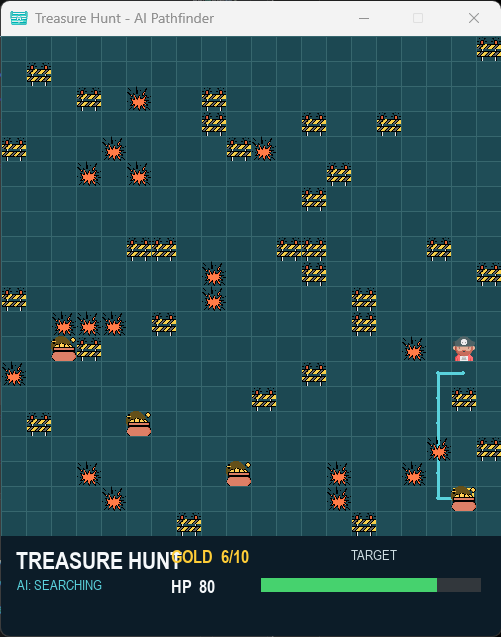
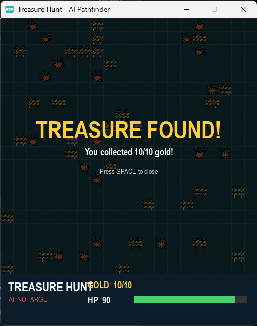

# 🏴‍☠️ AI Treasure Hunt

A Python-based AI treasure hunt game built with Pygame and A* pathfinding.

The game features an AI-controlled pirate that automatically navigates through a fixed maze, avoids obstacles and damage areas, and searches for the nearest treasure until all gold is collected.

## 🎮 About the Game

AI Treasure Hunt is a grid-based game where an AI-controlled pirate must navigate through a maze and collect all available gold.

The game environment contains:

- 🪙 Gold treasures
- 🪨 Obstacles
- 💥 Damage areas
- ❤️ Health points
- 🗺️ A fixed maze
- 🤖 AI-controlled movement

The AI automatically calculates paths through the maze and selects the nearest reachable gold using the A* pathfinding algorithm.

The main objective is to collect all 10 gold treasures while keeping the pirate's health above zero.

## 🤖 Artificial Intelligence

The main AI component of the project is A* (A-Star) Pathfinding.

The AI uses A* to find efficient paths through the grid while avoiding obstacles.

For each available gold location, the AI:

1. Calculates a possible path.
2. Checks whether the gold is reachable.
3. Calculates the path length.
4. Compares the available paths.
5. Selects the nearest reachable gold.
6. Moves automatically toward the selected target.
7. Repeats the process after collecting the gold.

The AI continues this process until all gold treasures have been collected.

## 🧠 A* Pathfinding

The project uses the standard A* evaluation function:

f(n) = g(n) + h(n)

Where:

- `g(n)` = cost of reaching the current position
- `h(n)` = estimated distance from the current position to the target
- `f(n)` = total estimated path cost

The game uses Manhattan distance as the heuristic:

h(n) = |x1 - x2| + |y1 - y2|

This is suitable for the game's grid-based movement.

## 🗺️ Game Environment

The game uses a fixed grid-based maze.

The maze contains different types of positions.

### 🟦 Walkable Areas

The pirate can move through normal walkable cells.

### 🪨 Obstacles

Obstacles block movement.

The pathfinding algorithm treats obstacle positions as unavailable when calculating paths.

### 💥 Damage Areas

Damage areas can be reached by the pirate, but entering one reduces health.

Each damage event reduces the pirate's health by:

10 HP

### 🪙 Gold

Gold represents the main objective of the game.

The AI searches for reachable gold and collects each treasure one by one.

## ❤️ Health System

The pirate starts with:

100 HP

Whenever the pirate reaches a damage area:

HP = HP - 10

The game continues while the pirate has health remaining.

If the pirate's health reaches zero, the game ends.

## 🏆 Win Condition

The AI wins the game when all available gold treasures have been collected.

The default game contains:

10 Gold Treasures

## 🎮 Game Features

- 🤖 Automated AI movement
- 🧠 A* pathfinding
- 🗺️ Fixed maze environment
- 🪙 Multiple treasure locations
- 🪨 Obstacles
- 💥 Damage areas
- ❤️ Health system
- 🏆 Win condition
- 🎨 Pygame graphical interface
- 📊 AI path visualization
- 🎯 Target selection
- 🏴‍☠️ Pirate character
- 🔄 Automatic navigation between targets

## 🛠️ Technologies Used

- Python 3.11
- Pygame 2.6.1
- A* Pathfinding Algorithm
- Heap Queue (`heapq`)
- Grid-based Navigation
- Artificial Intelligence
- Game Development

## 📁 Project Structure

ai-treasure-hunt/
│
├── main.py
├── th.py
│
├── box.png
├── damagee.png
├── gold.png
├── obstacle.png
└── pirate_1009968.png

### `main.py`

The main game file.

It contains:

- Game initialization
- Pygame interface
- AI movement
- A* pathfinding
- Gold collection
- Damage system
- Health system
- Obstacle handling
- Target selection
- Game loop
- Win/lose conditions

### `th.py`

Additional Python code related to the project.

### Image Assets

- `pirate_1009968.png` → Pirate character
- `gold.png` → Gold treasure
- `obstacle.png` → Obstacles
- `damagee.png` → Damage areas
- `box.png` → Game window icon

## ▶️ How to Run the Project

### Requirements

- Python 3.11
- Pygame

### 1. Clone the Repository

git clone https://github.com/CAROLJOY26/ai-treasure-hunt.git

### 2. Open the Project Folder

cd ai-treasure-hunt

### 3. Create a Virtual Environment

python -m venv .venv

### 4. Activate the Virtual Environment

For Windows PowerShell:

.venv\Scripts\Activate.ps1

### 5. Install Pygame

python -m pip install pygame

### 6. Run the Game

python main.py

## 🔄 Game Workflow

Start Game
↓
Initialize Maze
↓
Initialize Pirate
↓
Locate Gold
↓
Find Reachable Gold
↓
Calculate A* Paths
↓
Select Nearest Gold
↓
Move Pirate
↓
Check Obstacles
↓
Check Damage
↓
Check Gold Collection
↓
Select Next Gold
↓
Repeat
↓
Collect All Gold
↓
Win

If the pirate loses all health before completing the objective, the game ends.

## 🎯 AI Decision Making

The AI does not simply move randomly.

Instead, it evaluates the available treasure locations and calculates paths to them.

For every gold location, the AI attempts to find a valid path.

The path with the shortest distance is selected as the next target.

This allows the pirate to automatically navigate through the maze and make decisions based on the current game state.

## 🧩 Pathfinding Rules

The A* algorithm considers neighboring grid positions while searching for a path.

The AI:

- Checks positions within the game boundaries.
- Avoids obstacle positions.
- Calculates movement costs.
- Uses Manhattan distance as a heuristic.
- Builds a path toward the selected target.
- Returns the path when the target is reached.

This allows the pirate to navigate around blocked areas instead of moving directly through obstacles.

## 📊 Example Game Output

During gameplay, the terminal can display information such as:

Initial target: (4, 1)

Damage! HP: 90
Collected gold: 1/10
Collected gold: 2/10
Damage! HP: 80
Collected gold: 3/10
Collected gold: 4/10
Collected gold: 5/10
Damage! HP: 70
Collected gold: 6/10
Collected gold: 7/10
Collected gold: 8/10
Damage! HP: 60
Damage! HP: 50
Collected gold: 9/10
Collected gold: 10/10

This output provides a simple way to observe the AI's progress during the game.

## 📸 Screenshots

### 🎮 Gameplay

The AI-controlled pirate navigates through the fixed maze using A* pathfinding while collecting gold and avoiding obstacles and damage areas.

### 🏆 Win Screen

The AI successfully collects all treasures and completes the treasure hunt.

## 🚀 Future Improvements

Possible improvements for future versions include:

- Add multiple maze levels
- Add different difficulty levels
- Add multiple AI strategies
- Add moving obstacles
- Add enemies
- Add different types of treasures
- Add a scoring system
- Add sound effects
- Add background music
- Add player-controlled mode
- Add more advanced AI decision making
- Add performance statistics
- Add BFS and Dijkstra comparison with A*
- Add a larger game environment

## 📚 Learning Objectives

This project demonstrates practical experience with:

- Python programming
- Artificial Intelligence
- A* pathfinding
- Heuristic algorithms
- Grid-based navigation
- Game development
- Pygame
- Collision and obstacle handling
- Game state management
- Health systems
- Automated decision making
- Graph search algorithms

## 💡 Project Purpose

The purpose of this project is to demonstrate how an AI agent can navigate a game environment and make decisions using a pathfinding algorithm.

Instead of controlling the pirate manually, the AI determines where to move and which treasure to target.

The project combines Artificial Intelligence concepts with interactive game development to create a practical example of pathfinding and automated navigation.

## 👩‍💻 Author

**Carol Joseph Gorgi**

GitHub: [CAROLJOY26](https://github.com/CAROLJOY26)

---

⭐ If you find this project interesting, feel free to explore the code and the AI pathfinding implementation.
